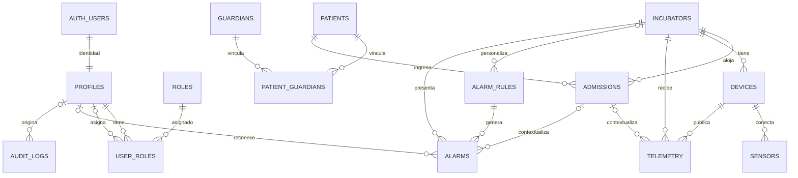

# Modelo de datos propuesto

> Estado: identidad, pacientes, tutores, relaciones paciente–tutor, incubadoras, Admissions, Devices, Sensors, Measurement Definitions y Telemetry normalizada están desplegados mediante migraciones Prisma. MQTT y alarmas siguen siendo diseño futuro. Los límites de alarma que se incorporen más adelante serán sólo configuración de demostración hasta contar con validación clínica formal.

## Criterios generales

- PostgreSQL/Supabase será el sistema de registro persistente; Supabase Auth resolverá identidad y NestJS autorización.
- Las entidades de dominio usan UUID generado por PostgreSQL. `profiles.id` reutiliza el UUID de `auth.users.id`.
- `telemetry` y `audit_logs` usan `bigint identity` por ser tablas append-only potencialmente voluminosas. Sus identificadores no deben tener significado de negocio.
- Todo evento usa `timestamptz` y UTC. `birth_date` y `birth_time` permanecen separados porque describen un dato civil; la zona o centro de origen debe conocerse al interpretarlos.
- Los registros clínicos e históricos se conservan. La eliminación física será excepcional; normalmente se cambia `status`.
- Todos los valores numéricos fisiológicos son `numeric`, no flotantes binarios. Precisión y unidades definitivas deberán validarse antes de la migración.

## Catálogos y enums provisionales

Los siguientes valores son candidatos a enums PostgreSQL o restricciones `CHECK`. La decisión final puede favorecer `CHECK`/catálogos cuando se espere evolución frecuente.

| Tipo | Valores iniciales |
|---|---|
| `profile_status` | `ACTIVE`, `INACTIVE`, `SUSPENDED` |
| `patient_status` | `ACTIVE`, `INACTIVE` |
| `patient_sex` | `MALE`, `FEMALE`, `UNSPECIFIED` |
| `incubator_status` | `AVAILABLE`, `IN_USE`, `MAINTENANCE`, `OUT_OF_SERVICE` |
| `admission_status` | `ACTIVE`, `DISCHARGED`, `TRANSFERRED`, `CANCELLED` |
| `device_type` | `ESP32`, `ESP8266`, `OTHER` |
| `device_status` | `ACTIVE`, `MAINTENANCE`, `DISABLED` |
| `sensor_type` | `DHT11`, `DHT22`, `MAX30100`, `MAX30205`, `OTHER` |
| `sensor_status` | `ACTIVE`, `MAINTENANCE`, `DISABLED` |
| `alarm_parameter` | `BODY_TEMPERATURE`, `AIR_TEMPERATURE`, `HUMIDITY`, `SPO2`, `HEART_RATE` |
| `alarm_severity` | `INFO`, `WARNING`, `CRITICAL` |
| `alarm_status` | `ACTIVE`, `ACKNOWLEDGED`, `RESOLVED` |

`blood_type` es un enum consistente con los ocho grupos ABO/Rh y `UNKNOWN`. Los nombres de rol son catálogo de datos (`roles`), no enum.

## Tablas

En las tablas siguientes, `NOT NULL` es la regla salvo que se indique **nullable**. Todos los `updated_at` deben actualizarse desde una función/trigger común o desde una capa de persistencia transaccional, decisión a concretar al elegir acceso a datos.

### `profiles`

| Columna | Tipo | Reglas |
|---|---|---|
| `id` | `uuid` | PK; FK a `auth.users(id)`; sin valor generado propio |
| `first_name` | `varchar(100)` | trim; no vacío |
| `last_name` | `varchar(100)` | trim; no vacío |
| `status` | `profile_status` | default `ACTIVE` |
| `created_at` | `timestamptz` | default `now()` |
| `updated_at` | `timestamptz` | default `now()` |

`auth.users` puede eliminarse con `ON DELETE CASCADE` hacia `profiles`; auditoría e historiales conservarán referencias nullable o snapshots. La eliminación de usuarios deberá ser una operación administrativa excepcional.

### `roles`

| Columna | Tipo | Reglas |
|---|---|---|
| `id` | `smallint generated always as identity` | PK |
| `code` | `varchar(40)` | UNIQUE; mayúsculas; inicialmente `ADMIN`, `DOCTOR`, `NURSE`, `TECHNICIAN` |
| `name` | `varchar(100)` | nombre visible |
| `description` | `text` | nullable |
| `created_at` | `timestamptz` | default `now()` |
| `updated_at` | `timestamptz` | default `now()` |

### `user_roles`

| Columna | Tipo | Reglas |
|---|---|---|
| `profile_id` | `uuid` | PK parcial; FK `profiles(id)` |
| `role_id` | `smallint` | PK parcial; FK `roles(id)` |
| `assigned_at` | `timestamptz` | default `now()` |
| `assigned_by` | `uuid` | nullable; FK `profiles(id)` |

Se adopta la tabla puente en vez de `profiles.role_id`: soporta varios roles, evita una migración si aparece una combinación como médico-administrador y permite auditar la asignación. PK compuesta (`profile_id`, `role_id`). `profile_id` usa `ON DELETE CASCADE`; `role_id` y `assigned_by` usan `RESTRICT` y `SET NULL`, respectivamente. Índice adicional por `role_id`.

### `patients`

| Columna | Tipo | Reglas |
|---|---|---|
| `id` | `uuid` | PK; default UUID |
| `medical_record_number` | `varchar(50)` | UNIQUE; normalizado; inmutable tras creación salvo proceso auditado |
| `first_name` | `varchar(100)` | no vacío |
| `last_name` | `varchar(100)` | no vacío |
| `birth_date` | `date` | no futura |
| `birth_time` | `time` | nullable si se desconoce |
| `sex` | `sex` | valor explícito, no inferido |
| `birth_weight_grams` | `integer` | gramos; entre 1 y 20000 como límite técnico |
| `gestational_age_weeks` | `smallint` | entero entre 0 y 60, límite técnico |
| `gestational_age_days` | `smallint` | entero entre 0 y 6 |
| `blood_type` | `blood_type` | enum; incluye `UNKNOWN` |
| `status` | `patient_status` | default `ACTIVE` |
| `created_at` | `timestamptz` | default `now()` |
| `updated_at` | `timestamptz` | default `now()` |

`status` es exclusivamente administrativo y se limita inicialmente a `ACTIVE`/`INACTIVE` hasta implementar Admissions. No expresa salud, riesgo ni diagnóstico. Los tutores se relacionan mediante `patient_guardians`; todavía no existe asociación con incubadoras.

### `guardians`

| Columna | Tipo | Reglas |
|---|---|---|
| `id` | `uuid` | PK; default UUID |
| `first_name` | `varchar(100)` | no vacío |
| `last_name` | `varchar(100)` | no vacío |
| `document_number` | `varchar(80)` | nullable; índice no único |
| `phone` | `varchar(30)` | nullable; formato normalizado |
| `email` | `varchar(254)` | nullable; comparar en minúsculas |
| `address` | `text` | nullable |
| `created_at` | `timestamptz` | default `now()` |
| `updated_at` | `timestamptz` | default `now()` |

No se impone UNIQUE global en documento, teléfono o correo: faltan tipo/país de documento y pueden compartirse contactos familiares. Una etapa futura puede añadir `document_type` y `document_country`. La relación pertenece a la asociación con cada paciente.

### `patient_guardians`

| Columna | Tipo | Reglas |
|---|---|---|
| `patient_id` | `uuid` | PK parcial; FK `patients(id)` |
| `guardian_id` | `uuid` | PK parcial; FK `guardians(id)` |
| `relationship` | `guardian_relationship` | `MOTHER`, `FATHER`, `LEGAL_GUARDIAN`, `GRANDMOTHER`, `GRANDFATHER`, `OTHER` |
| `is_primary_contact` | `boolean` | default `false` |
| `created_at` | `timestamptz` | default `now()` |

PK compuesta (`patient_id`, `guardian_id`). Paciente usa `ON DELETE CASCADE`; tutor usa `ON DELETE RESTRICT`. Un índice único parcial por `patient_id WHERE is_primary_contact = true` garantiza como máximo un contacto principal, complementado por reemplazo transaccional en NestJS.

### `incubators`

| Columna | Tipo | Reglas |
|---|---|---|
| `id` | `uuid` | PK; default UUID |
| `code` | `varchar(50)` | UNIQUE; identificador operativo inmutable |
| `name` | `varchar(120)` | no vacío |
| `location` | `varchar(150)` | no vacío |
| `serial_number` | `varchar(100)` | nullable; UNIQUE cuando existe |
| `manufacturer` | `varchar(100)` | nullable |
| `model` | `varchar(100)` | nullable |
| `status` | `incubator_status` | default `AVAILABLE` |
| `notes` | `text` | nullable; observaciones técnicas, no clínicas |
| `created_at` | `timestamptz` | default `now()` |
| `updated_at` | `timestamptz` | default `now()` |

`code` se normaliza a mayúsculas en NestJS. Hay índices por estado y fecha de creación descendente. `IN_USE` es por ahora un estado administrativo manual del modelo: no se deriva de pacientes y no se expone ninguna operación para cambiarlo hasta implementar Admissions. No existe control físico, dispositivo, sensor ni telemetría asociado en esta etapa.

### `admissions`

| Columna | Tipo | Reglas |
|---|---|---|
| `id` | `uuid` | PK; default UUID |
| `patient_id` | `uuid` | FK `patients(id)` |
| `incubator_id` | `uuid` | FK `incubators(id)` |
| `admitted_at` | `timestamptz` | inicio del intervalo |
| `discharged_at` | `timestamptz` | nullable mientras esté activo; mayor que `admitted_at` |
| `status` | `admission_status` | default `ACTIVE` |
| `notes` | `text` | nullable; observaciones administrativas, no historia clínica libre |
| `created_at` | `timestamptz` | default `now()` |
| `updated_at` | `timestamptz` | default `now()` |

Ambas FK usan `ON DELETE RESTRICT`. Índices (`patient_id`, `admitted_at DESC`) e (`incubator_id`, `admitted_at DESC`). Un índice único parcial impide más de un ingreso `ACTIVE` por paciente y otro impide más de uno por incubadora. Checks exigen que la salida no preceda al ingreso y que sólo los estados finales tengan `discharged_at`. No se instala `btree_gist` ni se impiden todavía todos los solapamientos históricos: los índices parciales cubren el flujo operativo inicial sin añadir complejidad prematura.

Crear un ingreso y cambiar la incubadora de `AVAILABLE` a `IN_USE` ocurre en una transacción. El cierre devuelve la incubadora a `AVAILABLE`. `MAINTENANCE` y `OUT_OF_SERVICE` no admiten pacientes. `Patient.status` no cambia: sigue siendo un estado administrativo independiente. Una transferencia se representa cerrando el ingreso con `TRANSFERRED` y creando después otro ingreso.

### `devices`

| Columna | Tipo | Reglas |
|---|---|---|
| `id` | `uuid` | PK; default UUID |
| `hardware_uid` | `varchar(100)` | UNIQUE; identificador físico normalizado a mayúsculas |
| `code` | `varchar(50)` | UNIQUE; etiqueta operativa |
| `device_type` | `device_type` | tipo de microcontrolador |
| `incubator_id` | `uuid` | FK obligatoria `incubators(id)` |
| `status` | `device_status` | default `ACTIVE`; sólo administrado por backend |
| `firmware_version` | `varchar(50)` | nullable |
| `last_seen_at` | `timestamptz` | nullable |
| `notes` | `text` | nullable; observaciones técnicas |
| `created_at` | `timestamptz` | default `now()` |
| `updated_at` | `timestamptz` | default `now()` |

La FK de incubadora usa `ON DELETE RESTRICT`. Hay UNIQUE sobre `hardware_uid` y `code`, e índices por `incubator_id`, `status` y creación descendente. `last_seen_at` queda nulo al registrar el dispositivo y no puede fijarse desde el frontend. MQTT aún no está implementado.

### `sensors`

| Columna | Tipo | Reglas |
|---|---|---|
| `id` | `uuid` | PK; default UUID |
| `device_id` | `uuid` | FK `devices(id)` |
| `sensor_type` | `sensor_type` | tipo físico |
| `code` | `varchar(50)` | UNIQUE global; normalizado a mayúsculas |
| `status` | `sensor_status` | default `ACTIVE` |
| `channel` | `varchar(50)` | nullable; conexión física/lógica informativa |
| `calibration_metadata` | `jsonb` | nullable; metadatos técnicos, no clínicos |
| `notes` | `text` | nullable; observaciones técnicas |
| `created_at` | `timestamptz` | default `now()` |
| `updated_at` | `timestamptz` | default `now()` |

UNIQUE global sobre `code`; índices por `device_id`, `sensor_type`, `status` y creación descendente; FK `ON DELETE RESTRICT`. No se incluye `unit`: un sensor puede producir varias magnitudes y sus unidades pertenecen a `measurement_definitions`. `calibration_metadata` no se expone en el formulario.

### `measurement_definitions`

Catálogo versionado de magnitudes, independiente del hardware y de límites clínicos. Contiene UUID, `code` UNIQUE estable, nombre, `unit_symbol`, `value_type` (`FLOAT`, `INTEGER`, `BOOLEAN`), categoría (`ENVIRONMENTAL`, `PHYSIOLOGICAL`, `TECHNICAL`), descripción nullable, `decimal_places` y timestamps. `decimal_places` tiene CHECK entre 0 y 6 y sólo recomienda presentación; no certifica precisión médica. Índices por categoría y creación descendente.

### `sensor_capabilities`

Asociación N:M explícita entre Sensor y MeasurementDefinition, con PK (`sensor_id`, `measurement_definition_id`) y `created_at`. Ambas FKs usan `ON DELETE RESTRICT`; existe índice inverso por `measurement_definition_id`. Describe capacidades configuradas, no lecturas reales.

### `telemetry`

| Columna | Tipo | Reglas |
|---|---|---|
| `id` | `bigint generated by default as identity` | PK |
| `incubator_id` | `uuid` | FK `incubators(id)` |
| `device_id` | `uuid` | FK `devices(id)` |
| `admission_id` | `uuid` | nullable; FK `admissions(id)` |
| `sensor_id` | `uuid` | FK `sensors(id)` |
| `measurement_definition_id` | `uuid` | FK `measurement_definitions(id)` |
| `value` | `double precision` | valor finito validado según `value_type` |
| `measured_at` | `timestamptz` | timestamp declarado por dispositivo |
| `received_at` | `timestamptz` | default `now()`; timestamp del servidor |
| `sequence` | `bigint` | entero no negativo |
| `boot_id` | `uuid` | identificador de cada arranque |
| `quality` | `telemetry_quality` | default `GOOD`; calidad técnica |

Cada fila contiene una sola magnitud. Las cinco FK usan `ON DELETE RESTRICT`. Hay índices temporales por sensor, dispositivo, incubadora, admission y definición, además de (`sensor_id`, `measurement_definition_id`, `measured_at DESC`). La unicidad (`device_id`, `boot_id`, `sequence`, `sensor_id`, `measurement_definition_id`) aporta idempotencia por arranque. Una futura política de retención, particionado, downsampling y archivado debe evaluarse antes de producción.

Se guarda `admission_id`, no `patient_id`: el ingreso expresa qué paciente ocupaba la incubadora en ese intervalo y evita dos fuentes de verdad. Es nullable porque pueden existir lecturas de prueba, mantenimiento o lapsos sin paciente. `incubator_id` y `device_id` sí se conservan para procedencia, seguridad y consultas históricas aunque el dispositivo sea reasignado posteriormente. NestJS validará que el ingreso, incubadora, dispositivo y tiempo sean coherentes dentro de la misma transacción.

### `alarm_rules`

| Columna | Tipo | Reglas |
|---|---|---|
| `id` | `uuid` | PK; default UUID |
| `parameter` | `alarm_parameter` | parámetro evaluado |
| `minimum_value` | `numeric(10,3)` | nullable |
| `maximum_value` | `numeric(10,3)` | nullable |
| `severity` | `alarm_severity` | severidad configurada |
| `enabled` | `boolean` | default `true` |
| `incubator_id` | `uuid` | nullable para regla global; FK `incubators(id)` |
| `created_at` | `timestamptz` | default `now()` |
| `updated_at` | `timestamptz` | default `now()` |

`CHECK`: al menos un límite presente y, si ambos existen, mínimo menor o igual al máximo. FK `ON DELETE RESTRICT`. Índices (`enabled`, `parameter`) e (`incubator_id`, `enabled`, `parameter`). La precedencia entre regla global y específica debe definirse antes de implementar el motor. No habrá límites clínicos rígidos en código.

### `alarms`

| Columna | Tipo | Reglas |
|---|---|---|
| `id` | `uuid` | PK; default UUID |
| `alarm_rule_id` | `uuid` | FK `alarm_rules(id)` |
| `incubator_id` | `uuid` | FK `incubators(id)` |
| `admission_id` | `uuid` | nullable; FK `admissions(id)` |
| `parameter` | `alarm_parameter` | snapshot de la regla |
| `measured_value` | `numeric(10,3)` | valor que abrió/actualizó la alarma |
| `severity` | `alarm_severity` | snapshot de la regla |
| `status` | `alarm_status` | default `ACTIVE` |
| `opened_at` | `timestamptz` | instante inicial |
| `acknowledged_at` | `timestamptz` | nullable |
| `acknowledged_by` | `uuid` | nullable; FK `profiles(id)` |
| `resolved_at` | `timestamptz` | nullable |
| `created_at` | `timestamptz` | default `now()` |
| `updated_at` | `timestamptz` | default `now()` |

FK de regla, incubadora e ingreso: `ON DELETE RESTRICT`; usuario de acknowledgement: `ON DELETE SET NULL`. Índices por `status`, (`incubator_id`, `status`), (`admission_id`, `opened_at DESC`) y (`alarm_rule_id`, `opened_at DESC`). Restricciones de coherencia temporal/estado asegurarán que acknowledgement y resolución sólo aparezcan en estados compatibles.

Para impedir alarmas repetidas, se propone una única alarma no resuelta por (`alarm_rule_id`, `incubator_id`, `admission_id`). Como `admission_id` puede ser nulo, el índice único parcial deberá usar `NULLS NOT DISTINCT` (PostgreSQL 15+) o dos índices parciales. El motor actualizará la alarma abierta y creará una nueva sólo después de resolver la anterior.

### `audit_logs`

| Columna | Tipo | Reglas |
|---|---|---|
| `id` | `bigint generated always as identity` | PK |
| `user_id` | `uuid` | nullable para sistema/eventos anónimos; FK `profiles(id)` |
| `action` | `varchar(80)` | acción normalizada (`PATIENT_CREATED`, etc.) |
| `entity_type` | `varchar(80)` | nullable |
| `entity_id` | `uuid` | nullable; sin FK polimórfica |
| `old_values` | `jsonb` | nullable; redactado |
| `new_values` | `jsonb` | nullable; redactado |
| `ip_address` | `inet` | nullable |
| `metadata` | `jsonb` | default `{}`; sin secretos |
| `created_at` | `timestamptz` | default `now()`; inmutable |

`user_id ON DELETE SET NULL`. Índices (`created_at DESC`), (`user_id`, `created_at DESC`) y (`entity_type`, `entity_id`, `created_at DESC`). `entity_id` no usa FK porque referencia varias tablas. La aplicación debe aplicar listas permitidas/redacción para evitar contraseñas, tokens o datos sensibles innecesarios en JSONB.

## Diagrama ER

## Seguridad y gobierno

- Supabase Auth responde **quién es el usuario**. `profiles` no almacena contraseñas ni tokens.
- NestJS valida el JWT, carga roles y aplica autorización en cada operación; ocultar controles en Next.js no es autorización.
- RLS de Supabase/PostgreSQL será una defensa adicional, no un reemplazo de los guards y políticas de NestJS. Las políticas se diseñarán junto con el patrón de conexión elegido.
- `SUPABASE_SERVICE_ROLE_KEY` y `DATABASE_URL` son exclusivamente de servidor. Nunca usar prefijo `NEXT_PUBLIC_`, registrar, incluir en firmware ni enviar al cliente.
- Sólo las variables `NEXT_PUBLIC_*` son públicas y quedan incorporadas al bundle del navegador. La publishable key identifica el proyecto pero no concede por sí sola permisos privilegiados; RLS sigue siendo obligatorio si el cliente accede a Supabase en el futuro.
- `.env`, `.env.local` y variantes están ignorados; únicamente `.env.example` sin valores reales se versiona.
- Datos de pacientes, contactos, telemetría y auditoría son sensibles: aplicar mínimo privilegio, cifrado en tránsito, backups protegidos, retención definida, redacción de logs y acceso auditado.
- Este sistema es educativo/prototipo. No es un dispositivo médico certificado ni debe presentarse como clínicamente validado. Las protecciones críticas futuras deberán funcionar localmente aunque fallen Internet o el servidor.

## Decisiones abiertas antes de migrar

1. Política de nombres, unidades, precisión y rangos técnicamente válidos para cada medición, sin confundirlos con límites clínicos.
2. Si los catálogos operativos se implementan como enum, `CHECK` o tablas editables.
3. Precedencia y versionado de reglas globales frente a reglas específicas de incubadora.
4. Retención, particionado, compresión y eventual archivado de telemetría y auditoría.
5. Historial formal de asignación de dispositivos a incubadoras; será necesario si los dispositivos se reasignan con frecuencia.
6. Reglas de múltiples contactos principales y catálogo de parentesco/tutela.
7. Estrategia de acceso de NestJS (conexión directa, pooler de Supabase y librería de datos), que se evaluará sin elegir ORM en esta etapa.
8. Requisitos legales locales para consentimiento, residencia, anonimización, eliminación y conservación de datos.
